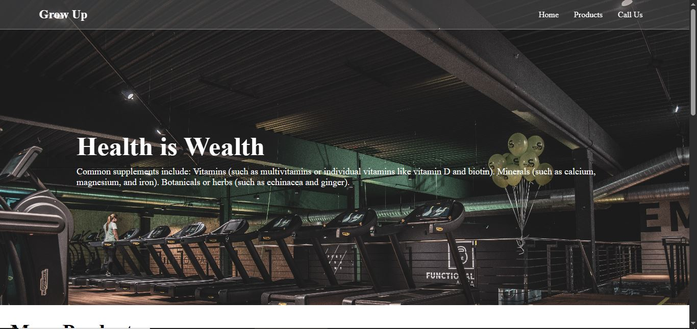
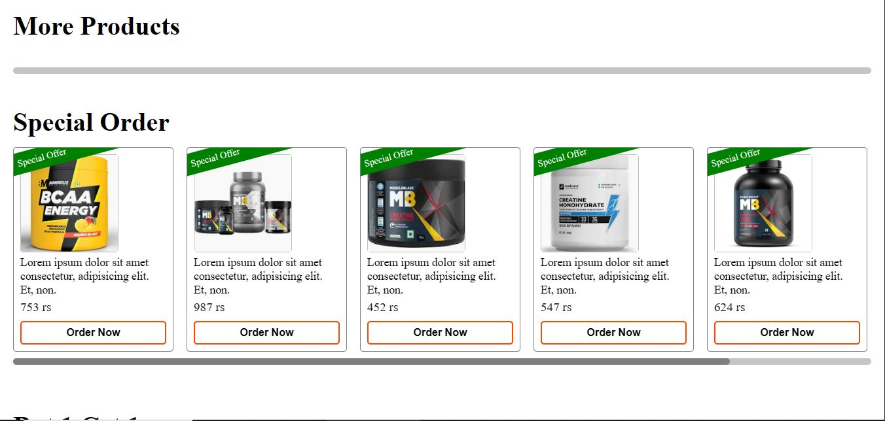
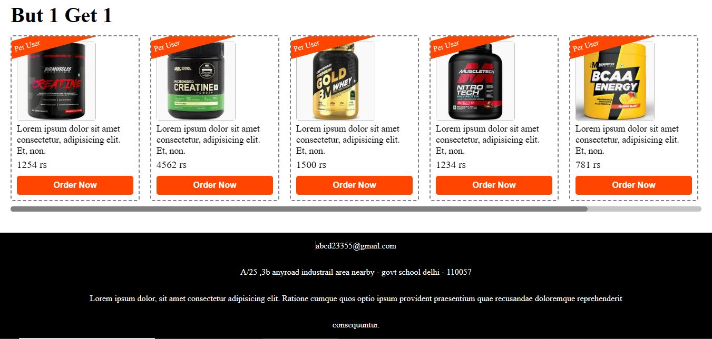
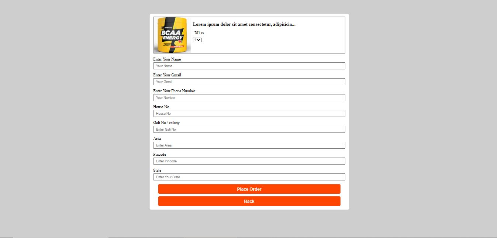

🏋️‍♂️ Grow Up - Supplement Store Website
📌 Project Overview

Grow Up ek supplement store website hai jahan users different health & fitness supplements browse karke order kar sakte hain.
Website ka UI simple aur user-friendly hai jisme multiple sections hain:

Home Page – Brand intro aur fitness-related tagline.

Products Page – All supplements with price & order button.

Special Offers – Buy 1 Get 1 aur Discount offers.

Order Form – Simple checkout page with user details form.

🖼️ Screenshots
🏠 

🛒 

🎁 

📦 

🚀 Features

Product listing with price & details

Special offer section (Buy 1 Get 1, Discounts)

Easy order form with Name, Email, Address, etc.

Responsive & clean design

🛠️ Tech Stack

HTML5

CSS3

JavaScript

⚡ How to Run Project

Repository clone/download karein

git clone https://github.com/Sachin-Shah-25/gym-javascript.git

✨ Future Enhancements

Payment Gateway Integration

User Authentication (Login/Signup)

Backend with Database (Node.js / Django / etc.)

Admin Panel for managing products